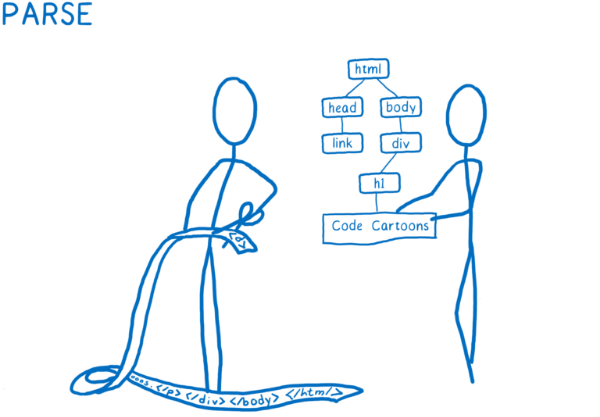
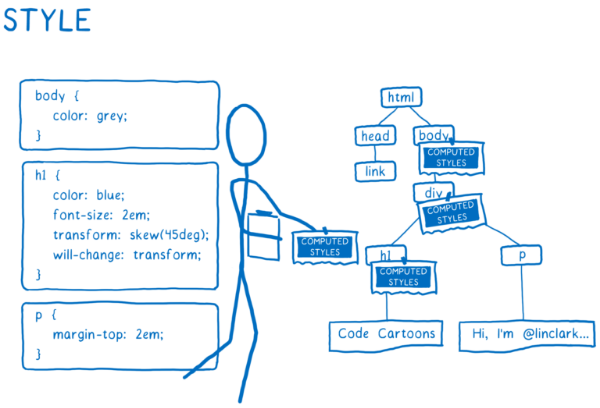
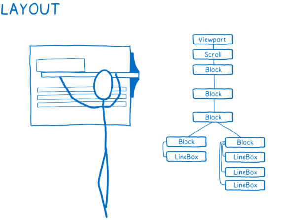
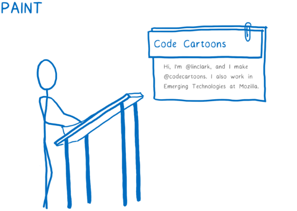
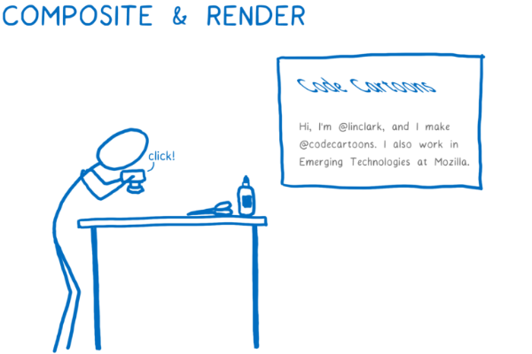

# Que son y para que nos sirve Html & Css ❓️
Html (lenguaje de marcado de hipertexto) sirve para estructurar toda nuestras paginas web 👨‍🔧

CSS (hojas de estilo en cascada) nos da vida a nuestros sitios web, poder estilizar nuestros textos, imagenes, botones. 👕 👖

Trabajan juntos, son la base para poder contruir una pagina web.

## Motores de renderizado 🧐

Cada uno de nuestros navegadores utiliza un motor de renderizado para poder transformar lo que nosotros estamos escribiendo en nuestros documentos Html o Css, y asi nosotros como usuarios podamos visualizar los cambios en pantalla. ✅

Navegador | Motor
----------|-------          
Chrome    |Blink
Edge ❌   | Edge html
Safari    | Webkit
Firefox   | Gecko

Los motores siguen 5 pasos para traducir nuestro codigo: 

* Pasa los archivos a objetos que el navegador pueda entender (DOM) 🖥️.

 > DOM (Document Object Model) es Html pero transformado en objetos que el navegador pueda entender.
 
* Calcula cada uno de los estilos que tiene que ir en cada uno de los nodos (estructura cada etiqueta) 🌳.

* Calcula las dimensiones de cada uno de los nodos (estructura) 📝.

* Pinta las diferentes cajas 🖌️.

* Toma las capas y las convierte en una imagen para mostrar en pantalla 💻.

