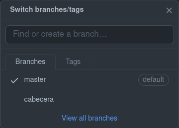

# **Manejo de ramas 🌿**

Para tener un buen manejo de las ramas debemos de recordar algunos comandos:

```js
git branch //sirve para saber que ramas existen en nuestro proyecto
alanf@alanf:~/Alan/proyecto1$ git branch
  cabecera
* master
```

Para crear una rama utilizamos el mismo comando de `git branch`:

```js
git branch nuevaRama //le tenemos que asignar el nombre de la nueva rama

alanf@alanf:~/Alan/proyecto1$ git branch footer //aqui se crea la nueva rama

alanf@alanf:~/Alan/proyecto1$ git branch
* cabecera
  footer
  master
```

Para poder desplazarnos entre nuestras ramas utilizando el comando:

```js
git checkout rama//le tenemos que asignar hacia que rama dirigirnos
alanf@alanf:~/Alan/proyecto1$ git checkout cabecera 
Switched to branch 'cabecera'
```

Al momento de crear un nuevo repositorio automaticamente trabajamos en la rama ***master***. Siempre que iniciemos un nuevo repositorio hay que cambiar y mover los archivos en donde trabajaremos a la rama ***main***

```js
git branch -M main //el -M quiere decir que moveremos todos los archivos existentes en la rama master -> main

alanf@alanf:~/Alan/proyecto1$ git branch
  cabecera
  footer
* main
```

Si se esta trabajando con una organizacion siempre debemos tomar en cuenta que para ejecutar el comando `git push` a los archivos que queramos subir debemos tener la version actual del repositorio:

```js
git pull //este comando nos devuelve la version mas actualizada hasta ese momento de nuestro repositorio remoto.
```

Nosotros podemos crear ramas como nos sea conveniente y no subirlas al repositorio remoto, pero de ser el caso nosotros podremos agregar distintas ramas con el siguiente comando:

```s
alanf@alanf:~/Alan/proyecto1$ git push origin cabecera 
Total 0 (delta 0), reused 0 (delta 0)
remote: 
remote: Create a pull request for 'cabecera' on GitHub by visiting:
remote:      https://github.com/AlanF20/BlogDePruebaPlatzi/pull/new/cabecera
remote: 
To github.com:AlanF20/BlogDePruebaPlatzi.git
 * [new branch]      cabecera -> cabecera
```



> Una buena practica de trabajo es trabajar en ramas distintas a ***main*** y solo subir los cambios que estamos seguros que estan listos para subir a produccion.

