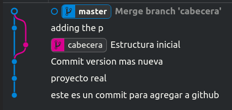

# **Introduccion a las ramas en git :octocat:🌿**

Las ramas son formas en las que nosotros podemos hacer cambios sin afectar la principal rama.

El commit mas reciente se le llama *Head*.

Crearemos una rama llamada *"Cabecera"*, cuando creamos una rama practicamente hacemos una copia del ultimo commit en otro lado y todos los cambios que hagamos no los vera la rama *master* hasta que lo volvamos a fusionar con un proceso que se llama ***Merge***.

```s
alanf@alanf:~/Alan/proyecto1$ git branch cabecera
```

Podemos trabajar en la rama que acabamos de crear insertando el siguiente comando:

```s
alanf@alanf:~/Alan/proyecto1$ git checkout cabecera
Switched to branch 'cabecera' 
```
  
> *Este comando es util para trasladarnos a cualquiera de las ramas existentes en nuestro repositorio.*

Como podemos saber en que rama estamos trabajando? eso lo podemos lograr con `git status`:

```s
alanf@alanf:~/Alan/proyecto1$ git status
On branch cabecera
nothing to commit, working tree clean
```  

```s
alanf@alanf:~/Alan/proyecto1$ git commit -am "Estructura inicial"
[cabecera b131ca7] Estructura inicial
 2 files changed, 11 insertions(+), 1 deletion(-)
```  

> *Con `git commit -am "mensaje"` le indicamos a git que archivos subiremos seguido del mensaje que llevara el commit (👀: que el comando `-am` solo añade archivos que previamente ya habiamos subido con `git add 'archivo'`).*

Una vez hemos terminado de trabajar en nuestra nueva rama, lo que procede es subir los cambios a la rama principal *master* fusionandolas, para esto debemos tener en cuenta algunas cosas: 

* Debemos trasladarnos a la rama principal(*master*) antes de ejecutar el comando ***git merge***.

> De lo contrario si ejecutaramos el comando git merge en alguna otra rama, fusionariamos los cambios realizados hasta el momento a dicha rama, convirtiendola en algun modo en la principal ahora.

* Debemos estar seguros de haber guardado todos los cambios realizados en cualquiera de las ramas (***git add***).

Una vez seguros de lo que subiremos a nuestra rama y asegurandonos de estar en la rama *master*:

```s
alanf@alanf:~/Alan/proyecto1$ git merge cabecera 
Auto-merging post.html
Merge made by the 'recursive' strategy.
 post.html |  1 +
 style.css | 11 ++++++++++-
 2 files changed, 11 insertions(+), 1 deletion(-)
```

Ejecutamos el comando ***git merge*** y como podemos observar se fusiona nuestra rama cabecera con la rama *master*.


